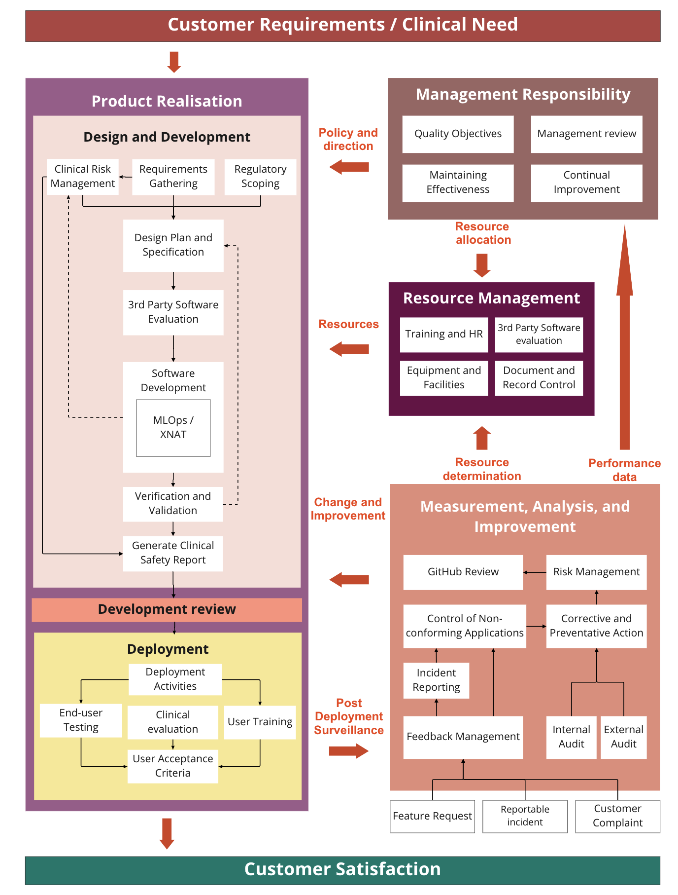
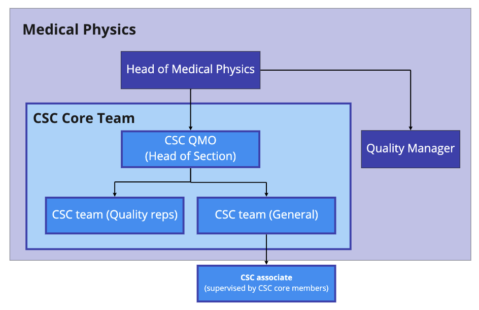

|                           |                     |
|---------------------------|---------------------|
| **Document ID**           | CSC PL.002          |
| **Document Version**      | 2.0.2               |
| **Author**                |                     |
| **Approval**              |                     |
| **QMS Version**           | 2.2.0               |
| **Regulatory References** | ISO 13485:2016      |

# Process Interaction
<!-- [13485:4.1.2c,6.1a,6.1b,7.1c,8.1] -->

## General

## Purpose 

This document describes the processes and how they interact within the CSC QMS. 

## Scope

This information pertains to CSC personnel working on CSC projects within the scope of the QMS processes.

As the CSC is a subsection of Medical Physics at Guys and St Thomas' NHS Foundation Trust, the document refers to 
processes within the wider Medical Physics ISO 9001 quality management system when required. 

##  Roles and Responsibilities 

| Role                                                | Responsibilities                                                                                               |
|-----------------------------------------------------|----------------------------------------------------------------------------------------------------------------|
| Quality Management Officer/ Quality Representatives | Regular review and maintenance of the processes and their interactions.   Keeping this document up to date. |
| All CSC staff                                       | Read and understand the process interactions outlined in this document.                                        |

 ## Definitions 

| Term      | Definition                                                                    |
|-----------|-------------------------------------------------------------------------------|
| QPulse    | Quality management software used by Medical Physics                           |
| QMS       | Quality Management System                                                     |
| Head Node | Dedicated Ubuntu server for CSC use  |

## Process Interactions

The QMS provides the necessary processes to ensure the CSC department can safely and effectively manufacture software as
a medical device to be deployed within the Trust.

The interactions between processes within the CSC QMS are described in the following sections. Processes and procedures 
specific to the CSC QMS are stored in this GitHub repository and have the code prefix "CSC XXX". This list also 
references documents from the wider Medical Physics QMS (ISO 9001 certified) that have the code prefix "D XXX" and 
are located in the QPulse application which is accessible by all CSC team members through their Trust desktop login. 

The diagram in Fig 1. describes the overview of the processes and their interactions within this QMS. 

Fig 1. Interaction of CSC processes

Where a process is outsourced to a third party outside the CSC Department and Medical Physics, the CSC 
Department retains responsibility for the conformity to customer requirements and the applicable regulations. The CSC 
Department will monitor the process and provide controls that are proportionate to the risks involved and the ability of
the external party to meet the customer and regulatory requirements.    

### 1.	Organisation

The responsibilities, authorities, and interrelation of all personnel who manage, perform, and monitor work affecting 
quality are defined in organisation charts and job descriptions. The Head of Medical Physics ensures that job 
descriptions are drawn up and maintained. Specific job requirements are defined in the responsibility section in 
procedures and work instructions.

Fig 2. shows the department hierarchy of staff member groups within the CSC.  

Fig 2. CSC organisation chart

### 2.	Quality System 

To ensure that its stated quality policy and ISO 13485:2016 requirements are met the CSC has documented its quality system. 
The documented system enhances the professional training and judgement of staff. Documents are referred to at a 
frequency dependent on the experience of staff. 

The CSC quality system sits within the wider medical physics, where CSC documents are stored in the CSC GitHub 
Repository and the medical physics processes are located in QPULSE. 

| Document and Record Control | CSC PR.013 |
|-----------------------------|------------|

### 3.	Design and development control 

The CSC provides a procedure for the safe and effective design and development of medical device software. It describes 
the documents and records required to comply with standards and regulatory requirements and activities 
necessary to develop clinical software that is usable, safe, and effective for use in a clinical environment. 

| Design and Development SOP       | CSC PR.001 |
|----------------------------------|------------|
| Paired System Administration SOP | CSC PR.026 |

### 3.1	Customer Requirements

Gathering user requirements is an art rather than an exact science. The CSC QMS provides a documented process to gathering 
requirements from stakeholders effectively. 

| Design and Development SOP | CSC PR.001 |
|----------------------------|------------|

### 3.2	Clinical risk management 
The CSC team is committed to building safe medical software that can be deployed into the clinical setting with confidence. 
The CSC has documented a process to fulfil clinical risk management activities in accordance with the ISO 14971.  
	
| Clinical Risk Management System  | CSC PR.002 |
|----------------------------------|------------|

### 3.3	Validation and verification

The activities undertaken to ensure customer requirements are met and software is built as planned have been documented 
in the following SOPs. 

| Validation verification SOP     | CSC PR.003 |
|---------------------------------|------------|
| **Third Party Software Validation** | **CSC PR.009** |

### 4.	Deployment and surveillance

A process has been documented for deploying applications built by the CSC into the clinical environment and the 
surveillance plan and activities required for ongoing monitoring of the performance of the application. 

| Integration and Deployment SOP         | CSC PR.012           |
|----------------------------------------|----------------------|
| **Monitoring and Surveillance SOP**    | **CSC PR.005**       |
| **Labelling**                          | **CSC PR.004**       |
| **Paired System Administration SOP**   | **CSC PR.026**       |

### 5. Feedback and Change Control

This QMS documents the processes for managing and acting upon feedback, and ensuring changes to any applications developed 
by the CSC Team are implemented in a controlled way.

| **Feedback Management** | **CSC PR.006** |
|-------------------------|----------------|
| **Change Management**   | **CSC PR.021** |

### 6.	Document and data control

Changes to documents and records related to either the CSC quality system and CSC projects stored in GitHub should be 
performed in accordance with the following processes to ensure traceability, independent review,  and correct assignment 
of responsibilities. 

| Document and Record Control        | CSC PR.013     |
|------------------------------------|----------------|
| **Reviewing GitHub Pull requests** | **CSC PR.017** |

### 7.	Training

All scientific, engineering, and technical permanent staff are professionally trained and qualified. Temporary staff, 
when engaged in quality system work, are supervised. All new staff undergo induction training. Relevant training records
are maintained by all staff members. 
Authorisation logs are produced for work requiring additional skills and knowledge. Only staff who are authorised may 
perform such special tasks without supervision.
Training is appraised on a regular basis and retraining or additional training identified in order to maintain high 
standards.

| Training                           | D PR.012       |
|------------------------------------|----------------|
| **Department Induction procedure** | **D PR.013**   |
| **Onboarding**                     | **CSC PR.020** |

### 8.	Purchasing

### 8.1 General

The CSC conforms to the procedures laid down by the Trust. 
The CSC ensures that purchased goods and services and those provided free or on loan, conform to specified levels of 
safety and quality. 

| **Purchasing and Control of Supplies**  | **D PR.024**      |
|-----------------------------------------|-------------------|
| **Supplies: Ordering**                  | **D WI.008**      |
| **Supplies Receipt of Goods**           | **D WI.009**      | 

### 8.2 Assessment of Suppliers (includes Sub-Contractors)
The CSC uses external suppliers approved by the Trust. Assessment and monitoring of external suppliers is performed by
the requisitioner.  Poor performance will result in approval being removed. The CSC will control sub-contracted work; 
relevant controls will be documented where appropriate. 

| Approved Suppliers  |  D I.004 |
|---------------------|----------|

#### 8.3 Purchasing Information
The CSC uses Trust procurement systems when placing orders. Each purchase instruction is reviewed for adequacy and 
approved by the relevant authority, before release.

| Supplies: Authorisation List | D I.003  |
|------------------------------|----------|

#### 8.4 Verification of purchased products

Products purchased by the CSC department shall be verified against the product specification and supplier evaluation 
results.

| Purchasing and Purchase Verification | CSC PR.018 |
|--------------------------------------|------------|

### 9.	Corrective and Preventative actions

All non-conformities raised in the system have remedial and/or corrective actions allocated to them by the Head of 
Section. Remedial actions provide an immediate attempt to correct or stabilise a problem. Corrective action generally 
involves a longer-term review of the underlying causes of the problem to prevent recurrence.  This would involve root 
cause and risk analysis.  When the QMO is satisfied that the corrective action taken is effective the non-conformity is 
closed.
Any corrective or preventive action undertaken will be at a level commensurate with the magnitude of the problem and the
risks involved. Preventive Actions are based on forecasts or the observation of trends and are enacted to prevent 
problems from arising.  QMO is responsible for identifying and introducing techniques to identify trends and for 
ensuring that preventive actions are implemented and effective. The QMO and Quality Representatives are responsible for 
identifying and evaluating risks and opportunities.  Preventive actions and their effectiveness are the subject of 
Section meetings/Management Review.

The CSC operates a complaints' procedure so that complaints made by patients, customers or staff, about quality system 
work is recorded, acknowledged, and followed up.
Incidents arising from error or deficiency in CSC procedures or training are followed up and corrective actions applied.
                     
		   
| Corrective and Preventative Action    | CSC PR.016     | 
|---------------------------------------|----------------|
| **Control of Non-Conforming Product** | **CSC PR.010** |

### 10.	Incident reporting

Incidents occurring as a direct or indirect result of actions of the CSC, or applications developed by the CSC,  are 
handled by the feedback management process. 

| Incident Reporting | CSC PR.014 |
|--------------------|------------|

### 11.	Internal Quality audit

The Medical Physics Quality Manager manages a Medical Physics department-wide audit programme using trained independent 
auditors. Auditors collect objective evidence on the correct implementation and continuing relevance of documented 
procedures. The results of audits are recorded and brought to the attention of the QMO. Staff are informed as necessary. 
Follow-up and unscheduled audits are performed as necessary.

| Internal Audit  | CSC PR.027 |
|-----------------|------------|

### 12.	Management review

Regular management review meetings are held to ensure the continued suitability and effectiveness of policies and 
procedures.

| Management Review        | CSC PR.011   |
|--------------------------|--------------|
| **Performance Analysis** | **CSC PR.010** |

### 13.	Continual Improvement 

The CSC is committed to listening to its staff and customers. When suggestions on improvement are made the Department 
will respond within the resources at its disposal.  The CSC maintains a quality feedback system to ensure suggestions 
and praise are recorded.  From time to time the CSC will canvass the opinions of customers in formalised surveys. 

| Suggestions, Praise & Customer Surveys  | CSC PR.011 |
|-----------------------------------------|----------|

### 14. Third party systems control 

A validation process to validate external software that will be used frequently in the development of projects under 
this QMS has been documented. 

| Third party software validation | CSC PR.009 |
|---------------------------------|------------|

### 15. Clinical Evaluation 

Applications will undergo a clinical evaluation prior to full deployment into routine clinical practice to ensure device
performance meets the requirements. 

| Clinical Investigation   | CSC PR.023  |
|--------------------------|-------------|