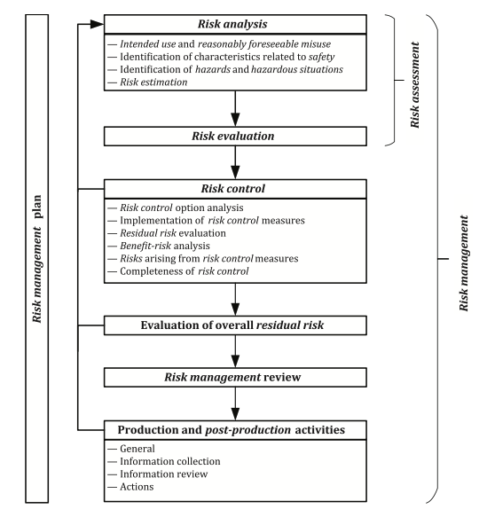

# Clinical Risk Management System SOP

## General

|                           |                |
| ------------------------- | -------------- |
| **Document ID**           | CSC PR.002     |
| **Document Version**      | 2.0.1          |
| **Author**                |                |
| **Approval**              |                |
| **QMS Version**           | 2.2.0          |
| **Regulatory References** | ISO 14971:2019 |

## Purpose

- This Clinical Risk Management System (CRMS) outlines the processes to be followed to ensure that all software
  developed by the GSTT Clinical Scientific Computing (CSC) team is developed, implemented and used in as safe manner.
- This CRMS provides a framework that promotes the effective risk management of potential health IT hazards and
  operational incidents.
- This CRMS addresses the requirements of ISO 14971:2019, DCB0129 and DCB0160 and follows best practice as promoted by NHS
  Digital.
- This CRMS will be reviewed and maintained in accordance with the Quality Manual of the QMS.

The aim of the CRMS is to ensure that all CSC staff involved with the development, implementation and use of healthcare
IT systems are aware of the activities that are required to be undertaken to ensure patient safety is improved rather
than compromised from the introduction of healthcare IT systems.
CSC is required to adhere to National Information standards created and monitored via the Data Coordination Board (DCB)
within NHS Information Standards frameworks.
The mechanisms used are approved process CMRS compliance documents.
This CRMS will be reviewed periodically to ensure that:

- changes in working practices are incorporated
- issues identified though an established internal audit programme are addressed
- the safety approach continues to adhere to the requirements of applicable international standards
- the system continues to protect the safety of patients in a complex and changing environment.

## Scope

This applies only to systems, products, services developed by the CSC team.

This document is for the CSC staff that are involved in ensuring the safety of healthcare IT systems, products or services.

## Definitions

| Term     | Description                                                                                                                                                                                                                                                                                                                                                                                                                                                                                                                                                                                                                                                                                                |
| -------- | ---------------------------------------------------------------------------------------------------------------------------------------------------------------------------------------------------------------------------------------------------------------------------------------------------------------------------------------------------------------------------------------------------------------------------------------------------------------------------------------------------------------------------------------------------------------------------------------------------------------------------------------------------------------------------------------------------------- |
| **CSO**  | Clinical Safety Officer - the person responsible for ensuring that the healthcare IT CRMS is applied to all clinical systems. The Clinical Safety Officer (CSO) for the Organisation is responsible for ensuring the safety of a healthcare IT system through the application of clinical risk management. The CSO must hold a current registration with an appropriate professional body relevant to their training and experience. They also need to be suitably trained and qualified in risk management or have an understanding in principles of risk and safety as applied to healthcare IT systems. The CSO ensures that the processes defined by the clinical risk management system are followed. |
| **DCB**  | Data Coordination Board                                                                                                                                                                                                                                                                                                                                                                                                                                                                                                                                                                                                                                                                                    |
| **HIT**  | Healthcare IT system                                                                                                                                                                                                                                                                                                                                                                                                                                                                                                                                                                                                                                                                                       |
| **CRMP** | Clinical Risk Management Plan                                                                                                                                                                                                                                                                                                                                                                                                                                                                                                                                                                                                                                                                              |
| **CRMS** | Clinical Risk Management System                                                                                                                                                                                                                                                                                                                                                                                                                                                                                                                                                                                                                                                                            |

## Roles and Responsibilities

At the start of the project the following roles must be allocated. The persons filling each role must have adequate
training.

| Role                          | Responsibility                                                    |
| ----------------------------- | ----------------------------------------------------------------- |
| Clinical Safety Officer (CSO) | Appointed to oversee the clinical risk management of the product  |
| Development lead              | Responsible for organising and completing all development actions |
| Product/ Process owner        | Takes ultimate responsibility for the deployed product            |

## 1. Healthcare IT Clinical Risk Management (CRM) Governance Arrangements

The responsibility for healthcare IT CRM within the GSTT is delegated to each department with respect to systems it
develops or procures.

## 2. Governance

Governance for patient safety within the Organisation is provided through the following forums:
Trust Risk and Assurance Committee (TRAC)

## 3. Healthcare IT Clinical Risk Management Deliverables

### 3.1 Clinical Risk Management File

CSC will establish a Clinical Risk Management File (CRMF) for each safety related healthcare IT system. The purpose of
the CRMF is to provide a central repository where all safety related information pertaining to the healthcare IT system
is stored and controlled.

### 3.2 Clinical Risk Management Plan

CSC will establish a Clinical Risk Management Plan (CRMP) for each safety related healthcare IT system. The purpose of
the CRMP is to identify the clinical risk management activities that are to be undertaken and the phasing of these
activities in the project lifecycle. The CRMP will also identify the resources required to discharge these clinical
risk management activities.

Fig 1. depicts the interaction of actions involved in the clinical risk management process.

Fig 1. Clinical Risk Management process diagram. source: ISO 14971:2019

### 3.3 Hazard Log

CSC will establish and maintain a Hazard Log (HL) for each safety related healthcare IT system. The HL will be
controlled and configured in accordance with the QMS document and record control CSC PR.013.

The HL will be made available within the CRMF. The purpose of the HL is to manage the effective resolution and
communication of hazard risk within CSC.

### 3.4 Clinical Safety Case

The Organisation will establish and develop a Clinical Safety Case (CSC) for each safety related HIT system.

## 4. Clinical Safety Case Report

The Organisation will issue a Clinical Safety Case Report (CSCR) for each safety related healthcare IT system. The
CSCR will be issued to support initial deployment and will be updated during the lifecycle of the healthcare IT system
should the safety characteristics change. The CSCR will be controlled and configured in accordance with the QMS
document and record control CSC PR.013.

## 5. Healthcare IT Clinical Risk Management Activities

### 5.1 Hazard Identification

CSC will conduct hazard identification workshops to identify potential hazards associated with the deployment and use of
a healthcare IT system. The CSO will be responsible for facilitating such workshops and ensuring attendance from
appropriate representatives. Typically, representatives from the following domains will be required:

- Information Governance
- Clinical
- Operational
- IT

The workshops will have minutes taken and a copy stored in the CRMF. If a healthcare IT solution is deemed not to be
safety related then this decision will be formally recorded and the CSO will email the programme lead with the outcome.

Where any third-party components are used to support the healthcare IT system then they will be considered in the scope
of the hazard identification activities and subsequent risk assessment. Where none are used a positive declaration to
this effect will be recorded in the minutes.
All identified hazards will be recorded in the HL.

### 5.2 Risk Assessment

The HL will be updated to capture the risk assessment.

### 5.3 Risk Evaluation

The HL will be updated to capture the risk evaluation.

### 5.4 Risk acceptability

The clinical risk management plan will state the threshold for risk acceptance, where risks that are calculated below
this threshold do not need to additional mitigations controls.

### 5.5 Risk Control and Residual Risk

Where the initial risk evaluation is deemed unacceptable, further risk controls will be required.
Details of the risk control measure and evidence of effective implementation will be captured in the HL.
The residual risks after risk controls are implemented will be calculated, described and analysed in the HL.

Clinical risk controls must be added to the system requirements specification if they are not already represented.

### 5.6 Deployment and Ongoing Maintenance

To support clinical safety activities undertaken during any deployment phases of a project or programme of work the
following documentation will be required to form a part of the overall approval process:

- Post Deployment Surveillance Plan (see CSC PR.005)

### 5.7 Incident Management

Clinical Risk Management activities within CSC and the healthcare IT programmes and services offered are completed
within the GSTT risk management strategy. As such clinical safety related incidents are dealt with using the QMS
Incident Report CSC PR.014.

## 6. Clinical Safety Competence and Training

### 6.1 Overview

The clinical safety activities described in this CRMS shall be undertaken by competent staff. Suitable training shall be
undertaken by staff to maintain and expand their level of competence.

### 6.2 Competency

All CSC staff shall be sufficiently competent for the roles and task which they are asked to undertake. Where an
individual does not have sufficient experience or knowledge then that person shall be monitored, and his/her work
reviewed, by someone who has the necessary competence. Such supervision shall prevail until it is judged that the
individual has amassed the necessary experience to undertake such tasks unsupervised.
In assessing competency, the different functional roles required to fully discharge the obligations of the CRMS, and
the necessary skills and knowledge needed for each, shall be considered. Primary functional roles may include:

- Conducting discrete safety analyses (for example, a HAZOP or FFA) or defining the Hazard Risk Indicators for a
  particular project.
- Making a valid judgement on the safety tasks, activities and techniques required for a given Health Software Product
  in order to justify the comprehensiveness and completeness of the safety assessment and produce the safety argument with
  supporting evidence.
- Assurance of safety assessments and healthcare IT software products. Performance of safety techniques and development
  of the safety argument for a particular healthcare IT software product must be independent to any assurance activities
  for the same.
- Improving and refining the overall CRMS, for example, audit, process change, quality.
- Ownership and leadership, for example, ultimate safety accountability, culture change, influencing and strategic
  direction.

The first test in establishing competency shall be at the interview stage where potential staff shall be assessed
against the above representative roles and agreed job descriptions. Thereafter, competence shall be monitored through
the organisation’s established appraisal scheme. Any perceived deficiencies identified during the course of the work
or at the appraised stage, especially during probation, shall be addressed immediately, for example, through the
assignment of a competent supervisor or the provision of suitable training.
All registered clinicians involved in safety roles shall, as a minimum, have completed an accredited training course.

### 6.3 Training

As part of the employment process and thereafter through the appraisal scheme, clinical safety personnel will undergo
suitable training to develop, maintain or enhance their competency level. Such training can comprise:

- ‘On the job’ training conducted under supervision
- Internal training courses
- Approved external training courses.
  All registered clinicians involved in clinical safety roles shall, as a minimum, have completed an accredited training
  course.
  Completion of any safety training shall be recorded by the individual on the annual appraisal form.

## 7. Audits

### 7.1 Overview

Audits shall be undertaken to ensure that projects are adhering to the defined safety requirements.

### 7.2 Internal Safety Audits

CSC shall undertake regular internal safety audits to ensure that projects are compliant with this CRMS. These audits
shall be conducted and recorded in accordance with the internal audit QMS procedure D PR.005.
The scope of an internal safety audit will be the formal CRMS and CSC's documentation supporting this document.

## Related documents

| Document Title                   | ID        |
|----------------------------------|-----------|
| Clinical Safety Case Report Template         | CSC F.012 |
| Hazard Log Template              | CSC F.013 |
