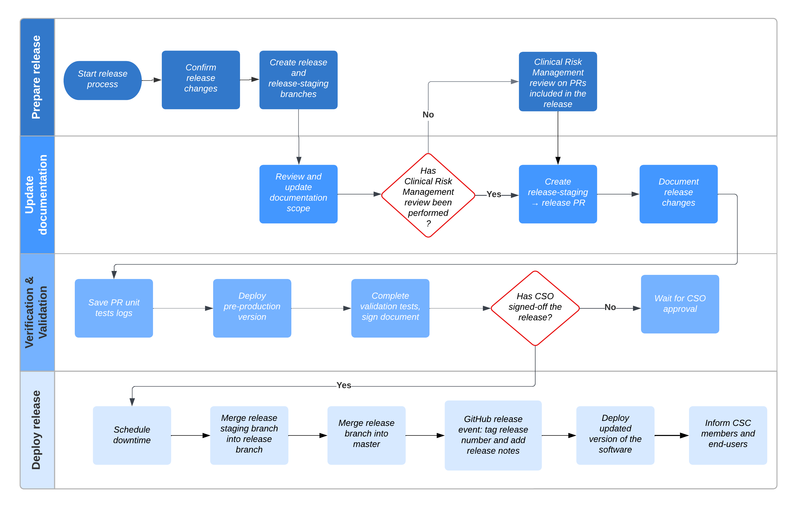

# Software Release Guidelines
<!-- [13485:7.5.1f,7.5.3]-->

## General 

|                           |                |
|---------------------------|----------------|
| **Document ID**           | CSC PR.025     |
| **Document Version**      | 2.0.1          |
| **Author**                |  | 
| **Approval**              |    |
| **QMS Version**           | 2.2.0          |
| **Regulatory References** |                |

## Purpose
This document describes the process of making a software release.

---

## Scope
This procedure must be followed during the development of all CSC computing projects that will directly affect patient care or interact with live clinical systems or databases.

---

## Definitions

| Acronym | Definition |
|---------|------------|
| ML      | **Machine Learning** |
| AI      | **Artificial Intelligence** |
| PR      | **Pull Request** - Github review action |

---

## Roles and Responsibilities

| Role                    | Responsibility |
|-------------------------|----------------|
| Clinical Safety Officer | Provide expertise and leadership in all activities associated with the evaluation of clinical risk management for the product. |
| Development Lead        | Generate and action the validation and verification plans |
| Clinical Lead           | Provide clinical expertise for verification and validation activities. |

---

## 1. Introduction

A software release can be defined as the process of distributing a set of changes in the software code from the development environment to the production environment. Releases should be numbered according to according to semantic versioning standards, usually as `MAJOR.MINOR.PATCH`. A minor release (e.g., `0.1.0` to `0.2.0`) usually involves new features or significant changes, while a patch release (e.g., `0.1.0` to `0.1.1`) generally includes bug fixes.
When the software is already deployed in a live environment, a new release may impact the end-users and should therefore be done in a streamlined manner to minimise clinical impact. Additional details on which release type is adequate can be found in CSC PR.021 Change Management SOP. 

## 2. Software Release Process
<!-- [13485:7.5.6a]-->
### 2.1 Release Preparation

Before starting the process of a new release, some prerequisites need to be met.
* **Confirm release changes**: Ensure `master` (default branch of the repository) contains all the intended changes, and that all the necessary PRs have been merged.
*  **Create Release-Staging Branch**: Branch off `master` to `release-staging/X.X.X`. (X.X.X is replaced by the version of the release being made.)
*  **Create Release Branch**: Branch off `master` to `release/X.X.X`. (X.X.X is replaced by the version of the release being made.)

N.B.: All of the following changes are to be made on the `release-staging/X.X.X` branch. No change should be made on the `release/X.X.X` branch.
### 2.2 Documentation Update

#### 2.2.1. **Update documents scopes**
Any document present in the documentation folder of the project should be reviewed and the scope should be updated to the release number. These documents include:

   - `documentation/clinical-risk-management-plan.md`
   - `documentation/design-plan.md`
   - `documentation/device_classification.md`
   - `documentation/evaluation-plan.md`
   - `documentation/acceptance_criteria.md`
   - `documentation/data/device.yml`
     
#### 2.2.2  **Clinical Risk Management Review**
Each Pull Request (PR) must have undergone an individual Clinical Risk Management Review as part of its approval process. The review must be conducted by an approved quality representative and should include the following: Summary of the Clinical Risk Management Review, Hazard Impact (list of the hazards the new feature might induce or mitigate). The Clinical Risk Management review should always be performed at a granular level on each of the Pull Requests and should not be deferred to the pre-release stage.

#### 2.2.3 **Open PR**
Open a Pull Request from the release-staging/X.X.X branch to the release/X.X.X branch. This Pull Request serves as the proposal for finalizing the release and will undergo further review processes, including CSO sign-off. (c.f. Review and approval)

### 2.4 Verification and Validation
The following changes need to be made to the Verification and Validation Plan.

#### 2.4.1 Changes summary
**Create release summary**: Create a change summary using GitHub's release notes and add it to the document. This is unnecessary for the very first release of the software. Follow the structure below for consistency. 
- Introduction: Briefly outline the changes and their impact.
- Overview: Explain why these changes are happening.
- Impacted Users: Clarify who or what components will be affected.
- Previous Changes: Summarize updates from the last release notes.
- Fixed Issues: List resolved issues.
- Limitations: Highlight any challenges or unresolved issues.

#### 2.4.2 Verification plan
* **Unit tests overview**:
  - Ensure all unit tests are passing.
  - Locate the logs produced by these tests in the repository under the directory: Repository > Checks > Development tests > test.
  - Download the log archive by clicking on the gear icon and "Download log archive". 
  - Include the log archive in the documentation folder of the repository. 

#### 2.4.2 Validation plan

* **Test Setup**: Deploy a pre-production version of the software in an environment that is isolated from any existing production versions.
* **Execute Tests**: Complete all required tests.
* **Sign the document**: Any document that has been reviewed needs to be signed and dated.

### 2.5 Review and approval 
<!-- [13485:8.2.6]-->
The CSO is responsible for reviewing and providing the final sign-off for the release. CSO sign-off is formally received when the CSO comments "approved" on the Pull Request. This comment explicitly confirms that the release-staging/X.X.X branch is ready for merging into the release/X.X.X branch.

### 2.6 Deployment and finalization (post-CSO sign-off steps)
Upon receiving CSO sign-off, the following steps are to be carried out:

* **Downtime Scheduling** Upon sign-off of the release, a downtime schedule should be communicated to all users to inform them that the application will be unavailable during this period. This is crucial to minimize clinical impact.
* **Merge branches**: Merge `release-staging/X.X.X` into `release/X.X.X`.
* **Create GitHub release event**: Tag the new release version in GitHub and create a GitHub "release event" to document the release and its changes. Both of these actions can be performed simultaneously through GitHub's "Draft a new release" feature. 
* **Master update**: Merge `release/X.X.X` back into `master` to ensure all documentation is up to date on the default branch.
* **Deployment**: Deploy the new release of the software. Deployment instructions are generally found on the project's ReadME.
* **Notification**: Once the upgrade is complete, communicate to all users and the CSC that the application is now available. This notification should include a summary of changes if not already provided.

  
## 3. Software release process flowchart
The following flowchart provides a quick overview of the different steps to follow during software releases.

