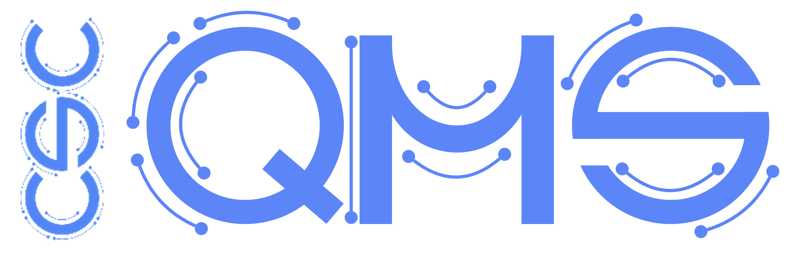

<!-- PROJECT HEADING -->
 

<h1 align="center">QMS-Template</h1>

  Open-source ISO 13485 QMS Template from GSTT-CSC
   
   
  <a href="https://github.com/GSTT-CSC/QMS-Template">View repo</a>
  |
  <a href="https://github.com/GSTT-CSC/QMS-Template/issues">Report Error</a>
  |
  <a href="https://github.com/GSTT-CSC/QMS-Template/issues">Request Feature</a>
   

### Description

This repository is an example of a quality management system (QMS) that can be used for the development of software as a
medical device (SaMD) and AI as a medical device (AIaMD). 

It's an empty version of the QMS that has been developed by, and is currently used by, the Clinical Scientific Computing (CSC) Team
at Guy's and St Thomas' NHS Foundation Trust (GSTT), London UK. So far, it has survived 18 internal audits and 3 external 
ISO13485 audits by two different notified bodies in the UK.

Having an ISO 13485 compliant QMS for medical software means that you: 
- build safe SaMD / AIaMD that are appropriate for clinical use, and generate the appropriate technical documentation
- conduct clinical risk management throughout software development with appropriate clinicians
- establish, risk assess, and continually improve your processes 
- train staff, verify their training, and keep it up to date
- continually evaluate your compliance to your standard operating procedures (SOPs) through internal audit
- have an established Corrective and Preventative Actions (CAPA) process to effectively solve issues at the root cause
- have management review meetings to evaluate effective and assign resources
- store documentation in a controlled way

The CSC will update this repo periodically as new challenges arise during our QMS journey. 

### Who is this repo for? Who would benefit most?

- **NHS Institutions** looking to implement a QMS for in-house developed SaMD and AIaMD _e.g. 
Medical Physics / Clinical Scientific Computing teams_
- **Life Science departments at universities** who are looking at spinning out companies from research groups developing AIAMD and SaMD
AIaMD and SaMD.
- **Small- and Medium- sized Enterprises (SME's)** starting their regulatory journey 

### Who are we? 

The CSC team within Medical Physics at GSTT aim to build SaMD and AIaMD to the same standard as commercially available 
medical software. We are a team consisting of predominantly clinical scientists, AI engineers, doctors, and NHS Scientist Training
Programme (STP) trainees.  

We have adopted an ethos of 'radical transparency' to make available as much of our output as possible, for the benefit
of the NHS and the wider health tech sector.

### Does cloning this repo mean I have a functional QMS?

No, this is a template QMS for you to use as a way of performing and logging SaMD / AIaMD development activities during 
software development. You would need to edit the Policies / SOP's and Template to reflect your team, 
institution/company, resources, and products you're building. 

### Other useful public repos

|                                                                                |                                                                                                                                                                                                                      |
|--------------------------------------------------------------------------------|----------------------------------------------------------------------------------------------------------------------------------------------------------------------------------------------------------------------|
| **[LINK: CSC Project Template](https://github.com/GSTT-CSC/project-template)** | A template repo that all CSC projects are started from. Integrates with the QMS for appropriate documentation, and MLOps to integrate with our machine learning pipeline for training models on our infrastructure.   |
| **[LINK: CSC MLOPs](https://github.com/GSTT-CSC/MLOps)**                       | A CSC open source python package for machine learning operations - Training ML models using docker, and logging these models and training artefacts in MLflow.                                        |

### MHRA Engagement

The UK Medicines and Healthcare products Regulatory Agency (MHRA) will be involved in the development of this repo going 
forward, as a practical means of two-way communications between the regulator and healthcare institutions / SMEs /
start-ups / academia so updates to the regulations in the UK are sensible.

### License

| Apache-2.0  |  
|-------------|

### Please join our open-source QMS community 

Please fork (online) / clone (local) this repo and see if you can implement in your institution. 
Get in contact with CSC on gstt.clinicalscientificcomputing@nhs(dot)net if you want to know more. 

**New Users**

Consult the Wiki for deployment instructions. The CSC will provide consultancy on setting this up and QMS training for 
NHS departments.

[LINK TO QMS SETUP INSTRUCTIONS](Work-Instruction.md)

**Established Users**

Please engage in conversations in the issues on how to modify this repo to comply with updated regulations / standards. 
Any suggestions you have recorded from internal and external auditors would be much appreciated!

**Regulatory Consultants**

We would greatly appreciate input from medical device regulatory consultants to rectify any glaring holes.

**NHS Clinical Engineering Departments**

We would love to hear from clinical engineering departments in the NHS who assess the technology readiness level (TRL) 
of SaMD in development. We wish for this repo to automatically provide estimates of minimum documentation and software 
performance required to conduct clinical evaluations.

### Sense About Science Handover Framework

Just because you can, doesn't mean you should...

Vast amounts of research funding, investment and effort, is wasted creating

### Ethos and Guidelines  

In the spirit of quality management we are striving for continual improvements to the repo to assist UK healthcare 
institutions, academic institutions and SME's in developing USEFUL and SAFE medical software by increasing access to 
clinical and regulatory expertise **_collaboratively_** across public private and regulatory space. 

- Share your auditor experiences without naming notified bodies or individual audits.
- Share SaMD and AIaMD incidents without explicitly naming healthcare institutions or patients.
- Reflect on types of SaMD/AIaMD products without explicitly naming them when suggesting improvement.
- Polite debate is encouraged, and discussions will be fed back to the MHRA.

### Roadmap

1. Implement MHRA guidance for AIaMD in SOP's and templates

2. A wiki to help set up QMS and useful info on regulations and deployment platforms.
3. Example repo with full technical documentation for a **[MONAI Application Package (MAP)](https://monai.io/deploy.html)**: a custom Docker 
container that works on common AI deployment platforms.
4. Automation of trend analysis (CAPA resolution times, code review times, stakeholder engagement etc.) through GitHub
Actions
5. Automation of ISO13485:2016 / ISO62034:2006 self-auditing through GitHub Actions
6. Generation of audit reports for internal and external auditors 
7. Provide suggested schedules for QMS activities for NHS CSC departments 

### Acknowledgments

- [**Open Regulatory**]() - We sourced many of our SOP's from the publicly ISO13485 templates from OpenRegulatory, you
will see their license at the bottom of many of our documents. 

- [**Innolitics RDM**]() - We use Innolitics `rdm` python package for generating the technical documentation for 
individual project repo's. Another fantastic company who build SaMD/AIaMD for FDA approval in the US. 

  
- [**All past and present CSC team members**](https://gstt-csc.github.io/team.html) who have contributed to the
development of this QMS, and your effort to get it off the ground and supporting it as a team. 

---
### Useful links

- **[CSC Website](https://gstt-csc.github.io/ )**
Our website.
- **[MHRA webpage for Software and artificial intelligence (AI) as a medical device](https://www.gov.uk/government/publications/software-and-artificial-intelligence-ai-as-a-medical-device)**
Latest consideration from the MHRA on SaMD and AIaMD
- **[OpenRegulatory Slack Channel](https://openregulatory.com/community)**
A great community Slack channel hosted by OpenRegulatory - connecting Regulatory professionals across Europe.
